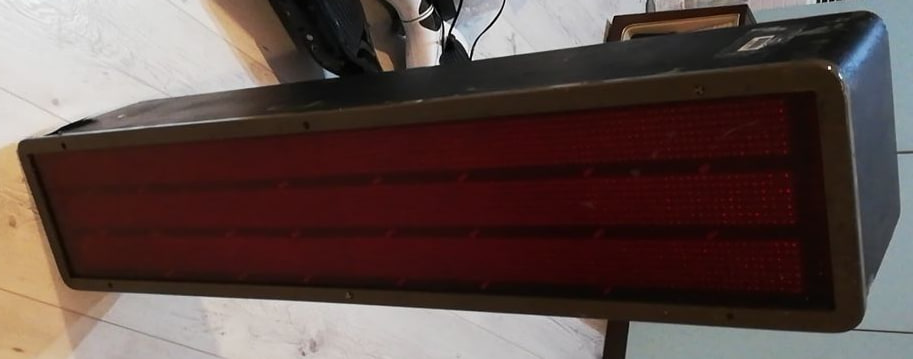

## TFL Bus Countdown Display reverse engineering

This project aims at reverse engineering the Countdown Display normally found at Busshelters in London.
This seems to be the first generation of those displays.
They are probably made by Trueform and/or Vix Technology; albeit, there are no markings visible indicating this.

**To-Do:**

 - [x] Reverse engineer the LED Matrix
 - [ ] Make Custom Board and Software to Controll the Matrix
 - [x] Dump the Software on the SRAM IC on SPU/MD2
 - [ ] Reverse enigneer the SPU/MD2 Board
 - [ ] Find out how to communicate with the Original Hardware
 - [ ] Reverse engineer the EXT/MD1 Board
 - [x] Dump EXT-MD1 EPROM

